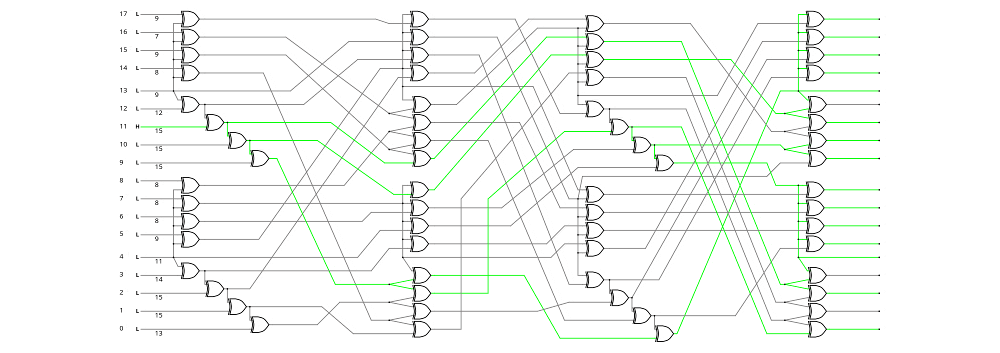
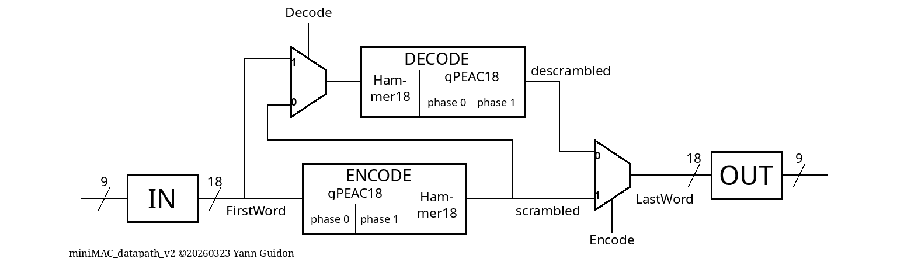
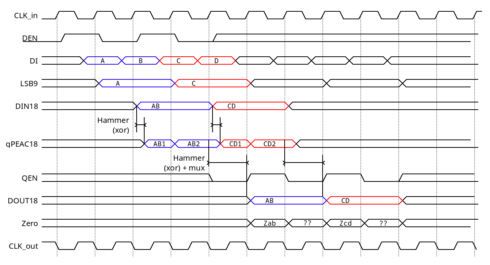

Note: after the messy tapeout on iHP26a, porting to CMOS5L PDK.

## What is this miniMAC

IMPORTANT: This custom circuit and protocol is not at all compliant or even compatible, even remotely linked to any 802.3 standard. It's all explained and detailed on Hackaday at https://hackaday.io/project/198914

The miniMAC is a (currently partial) Media Access Controller for a simplified data link over twisted pairs. It provides error detection and scrambling of 16-bit data words, which are combined with a 17th bit for data/control framing (C/D). The 18-bit result is suitable for sending to a (custom) PHY (see https://hackaday.io/project/203186 ) for serialisation and line coding. This unit chains two sophisticated circuits:

- The term "gPEAC" means "generalised Pisano with End-Around Carry" (see https://hackaday.io/project/178998 ), a class of PRNG/scrambler/checksum that uses different mathematics than Galois-based LFSR. The gPEAC18 unit is a non-power-of-two additive-based scrambler-checksum, with modulus=258114, orbit=66623095108 and its state is impossible to flush and freeze. It combines the 17 bits and creates an extra check bit. They both work as super-parity bits.

- "Hammer" is a contraction of the "Hamming distance maximiser". The Hammer18 unit is a XOR-based (bijective) scrambler that boosts the Hamming distance on the scrambled 18-bit word. This version contains 3 layers of taylored permutations between 64 XOR2 gates, with very strong avalanche: 

Conveniently, the same sea-of-XOR is identical, both for encoding and decoding, and the decoding side is "recursive" such that it amplifies any transmission error at the receiving end. The sorted avalanche for a single bitflip is : 7 8 8 8 8 9 9 9 9 1 12 13 14 15 15 15 15 15 (total=200). The 64 XOR2 gates have a propagation delay of 10 gates, yet the effective latency in the system is just one XOR in the critical datapath:

These very different types of circuits are complementary, together they provide very strong scrambling, eliminate problems inherent with classical LFSRs, and detect errors very early. With an equivalent of 56 bits of state and uncrashable mathematics, the system remains fast, compact and tailored for safety and early retransmission to save bandwidth/latency and reduce buffer sizes (and cost).

An external circuit is required to implement the higher-level protocol, buffering and retransmission logic.

## How it works

The gPEAC requires two cycles, two passes through the adder: first to compute the sums, then to adjust the modulus. OTOH the Hammer18 circuit requires one depth of XOR, but at different places:

- For encoding, the input data goes through gPEAC then Hammer is inserted at the end of the last cycle.

- For decoding, the scrambled data goes through Hammer at the start of the first cycle of gPEAC descrambling.

Due to pin constraints, the 18-bit data words are transmitted in two cycles with 9-bit half-words. Counting input and output (2 cycles each), the overall latency is 5 cycles, following a sequence that is internally started when data is initially input with Den=1. Even at the low default 50MHz clock speed, that's still a bandwidth of 25M×18=450Mbps: fast enough to oversaturate a Cat5 twisted pair.

This tile contains four main pipelined units, sequenced by a shift register:

- the input unit assembles a 18-bit word from two consecutive 9-bit halfwords
- the encode unit scrambles 17 bits and generates a 18-bit word
- the decode unit descrambles the 18-bit word, restores the 17-bit word and eventually generates an error flag.
- the output unit splits the 18-bit words back into two consecutive 9-bit halfwords

The encode and decode units can be tested separately or together in the "loopback" mode.

## How to test

First let's examine the pinout. The inputs:
- CLK is the main clock, driving the whole circuit.
- Reset synchronously restores the registers' initial values.
- Enc and Dec select the pipeline routing mode:
  - Enc=0, Dec=0 : loopback mode => encodes then decodes, the delayed output (8 cycles) must be identical to the input.,
  - Enc=0, Dec=1 : decode mode => the cleartext input is scrambled and output after 5 cycles,
  - Enc=1 : encode mode => the scrambled input is restored to cleartext after 5 cycles.
- DI0 to DI8 are 9-bit data half-words that are sampled at the rising edge of CLK.
- DEN is Data ENable input, signalling the presence of the first 9-bit half-word of the pair on DI0:8. The second half MUST follow immediately, during the next cycle of CLK.

The outputs:
- CLK_out provides an appropriate clock, adjusted for phase and delay due to onchip routing, for easy chaining: output signals are updated on the falling edge of CLK_out.
- DO0 to DO8 are the data half-word.
- QEN is the "output enable" generated by the internal sequencer, that signals that a first half-word is available.
- Z is a flag set to 1 when the decoded output has DO[15:0] cleared (think of a 16-bit NOR), useful to implement the higher-level protocol.

Notes :
- Data half-words are clock-sourced, to allow seamless chaining of multiple chips.
- Decoding errors (and Zero) are signalled but not managed/acted upon, a FSM and appropriate circuits must reset the registers.
- The input/plaintext word contains the C/D bit and an unused bit. C/D should be on Dx8 of the first halfword for fastest detection.
- The output/scrambled word contains the C/D bit and an error bit (saves a pin)
- Asserting DEN during more than one cycle is an error condition.
- The Zero output is always active (encoding as well as decoding) but gives a valid result only when QEN is asserted. It does only check the data bits: [7:0] and [17:9], conveniently mapped to the output byte pins.
- Do not change the Enc and Dec while data are in the pipeline, do it during the Reset state.

## External hardware

Custom boards or adapters will be made. I will try to get a pair of chips to connect together, such that I can verify a whole transmission chain.

## Next developments

This started as a VHDL to Verilog+IHP PDK port but it will likely grow to a more-featured project.

* I'll try to get 2 boards to test both coder and decoder in a chain, to simulate noisy communications.

* In parallel I try to design a decent PHY, a much more difficult endeavour.

* Logically, the MAC must be completed with a FSM, a buffer and a host interface, likely in the next tapeout so I can play with memory blocks.
